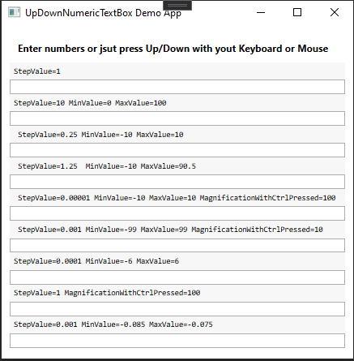

# UpDownNumericTextBox 
UpDownNumericTextBox is a custom WPF TextBox that accepts only numbers. 

## Features
1. The text box receives numbers only. 
2. Numbers can be entered with floating Point (decimal numbers).
3. Increment number can be increased using the Mouse Wheel when moving from top to bottom. The number increases by 1 for whole numbers or 0.1 for decimal numbers with each upward movement of the wheel and decreases by one with every movement of the wheel downward.
4. The number can be increased using the Arrows Buttons Up/Down buttons on the keyboard.
5. The increment amount can be multiplied by a specific value when holding down the Ctrl button on the keyboard.
6. Requires .NET Framework 4.5 
7. Demo App :
   

## UpDownNumericTextBox Proprties 
|Proprtiy | Description | Default |
| -- | -- | -- |
StepValue (decimal) | Mouse or keyboard up and down decimal step value (Accepts floating point) |  1
MinValue (decimal) | Minimum allowed decimal number | ±1.0 x 10-28
MaxValue (decimal) | Maximum allowed decimal number  | ±7.9228 x 1028
MagnificationWithCtrlPressed | Number to multiply step value with when pressing CTRL while incrementing or decrementing number. Useful to easily reach target number |  10

## Usage 
- Import `UpDownNumericTextBox.dll` to your References in your C# project. 
- Add to XAML file `xmlns:CustomNumericTextBox="clr-namespace:CustomNumericTextBox;assembly=UpDownNumericTextBox"`
- Create controls in your XAML file e.g. `<CustomNumericTextBox:UpDownNumericTextBox />`
- Order of proprties is as the following:
   -  StepValue
   -  MinValue
   -  MaxValue
   -  MagnificationWithCtrlPressed
